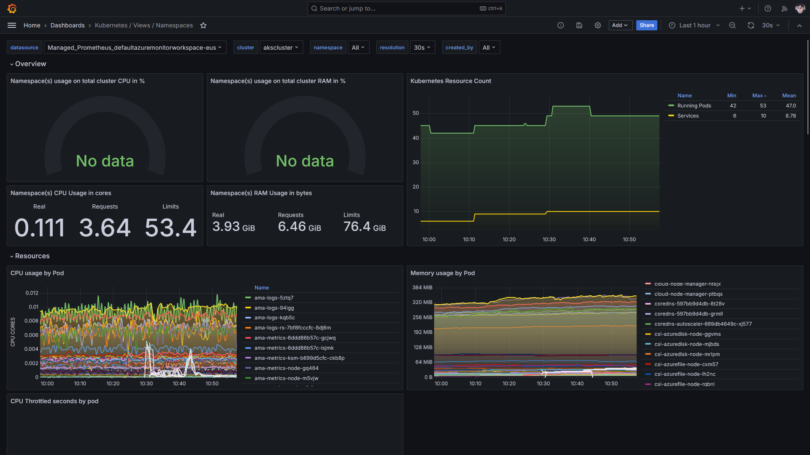

# Kubernetes-Grafana-Prometheus_Dashboards
Exemplos de dashboards do Grafana úteis para monitoramento de um cluster Kubernetes e que dependem de métricas do Prometheus.

Marketplace: https://grafana.com/grafana/dashboards/?search=kubernetes&orderBy=updatedAt&direction=desc

---

## Kubernetes Dashboard By Chever

Útil em consultas envolvendo métricas de Pods.

Link: https://grafana.com/grafana/dashboards/22237-kubernetes-dashboard-by-chever/

---

## Kubernetes / Views / Namespaces

Útil inclusive para visualizar em que momento um workload escala.

Link: https://grafana.com/grafana/dashboards/15758-kubernetes-views-namespaces/

---

## Cluster / Global performance

Visão geral do consumo de CPU e memória em um cluster.

Link: https://grafana.com/grafana/dashboards/21839-cluster-global-performance/

---

## Kubernetes Overview

Visão geral de diferentes elementos de um cluster.

Link: https://grafana.com/grafana/dashboards/21410-kubernetes-overview/

---

## Kubernetes Pod Dashboard

Métricas a nível de Pod.

Link: https://grafana.com/grafana/dashboards/21298-kubernetes-pod-dashboard/

---

##  Kubernetes - Pod Overview

Diferentes visões a nível de Pod.

Link: https://grafana.com/grafana/dashboards/17684-kubernetes-pod-overview/

